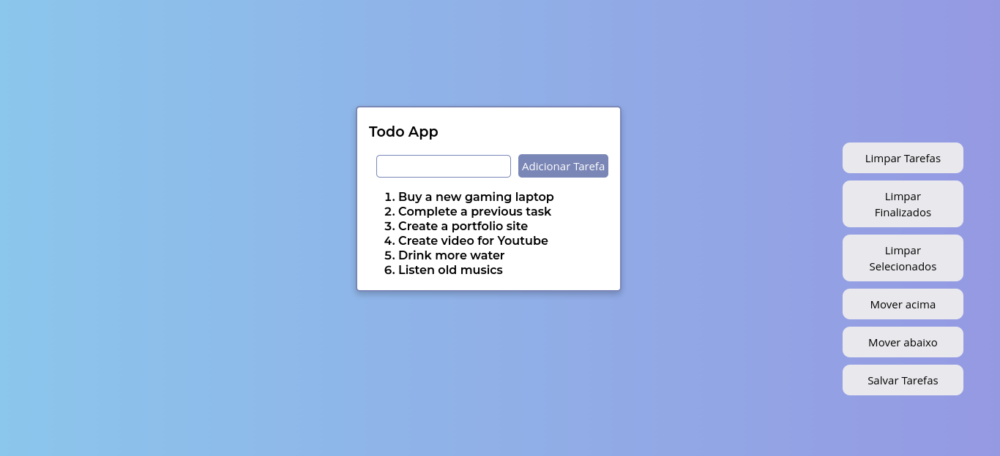

# ToDo List Project

> O projeto consiste em uma aplicação de lista de tarefas utilizando HTML, CSS e JS manipulando elementos do DOM.

## 💻 Pré-requisitos

Para usar, verifique os seguintes requisitos:

- Você ter instalado `VSCode e extensão Live Server`

⚠️ Obs.: Caso não tenha as ferramentas acima, você pode acessar a aplicação <a href="" >aqui</a>

## ☕ Usando ToDo List Project

Uma vez com a aplicação iniciada em seu navegador, basta digitar a tarefa desejada e adicioná-la a lista, manipulando-a como desejar!

## 📫 Contribuindo para o ToDo List Project!

1. Clone este repositório.
2. Crie uma branch: `git checkout -b nome-da-branch`.
3. Faça suas alterações e confirme-as: `git commit -m 'mensagem-de-commit'`
4. Envie para o branch original: `git push origin nome-do-projeto / local`
5. Crie a solicitação de pull request.

Como alternativa, consulte a documentação do GitHub em [como criar uma solicitação pull](https://help.github.com/en/github/collaborating-with-issues-and-pull-requests/creating-a-pull-request).

[⬆ Voltar ao topo](#todo-list-project) 
